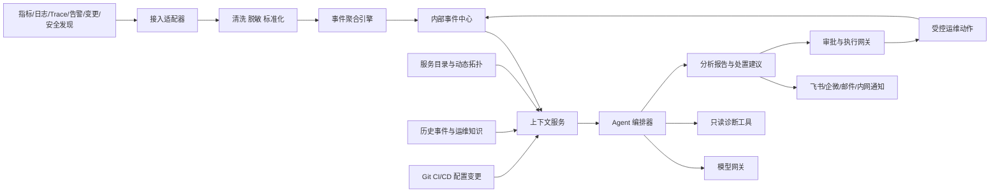

# 目标架构

## 部署定位

产品包含两个独立版本：

### AWS 云上版

- 部署在客户 AWS 账户或确定的 SaaS/托管边界内。
- 接入 CloudWatch、CloudTrail、AWS Config、EKS、RDS、ALB、WAF、Security Hub 等数据。
- 模型优先通过统一模型网关接入 Amazon Bedrock，也可扩展 SageMaker 或自建推理服务。
- 使用 AWS 身份、网络、密钥、对象存储和高可用能力。

### 本地私有化版

- 部署在客户 Kubernetes 或本地服务器环境中。
- 支持私有化联网和完全断网两种运行 Profile。
- 模型、知识库、可观测后端、事件中心和审计全部可在本地运行。
- 支持 Kubernetes、虚拟机、物理机和传统中间件。

两者共享产品代码、协议和安装规范，但默认不存在运行时数据通道。

## 逻辑架构

## 核心模块

| 模块 | 职责 |
|---|---|
| 接入适配器 | 兼容 OTLP、Prometheus、Webhook、Syslog、JMX、SNMP 和云 API |
| 数据处理 | 字段白名单、脱敏、过滤、采样、聚合和统一资源身份 |
| 事件聚合 | 告警去重、抑制、关联、影响范围计算和事件生成 |
| 内部事件中心 | 保存事件事实、状态、证据、责任人、审批和处理时间线 |
| 服务目录 | 保存服务定义、负责人、重要程度、仓库、SOP 和声明式依赖 |
| 动态拓扑 | 从 Trace、Kubernetes、云资源和网络关系构建运行时依赖 |
| 变更时间线 | 关联发布、配置、基础设施和人工操作记录 |
| 知识库 | 管理运维手册、历史故障、复盘、架构文档和安全规范 |
| Agent 编排 | 选择工具、检索上下文、形成假设、验证证据和生成建议 |
| 模型网关 | 路由本地/云端模型，统一超时、审计、限流和数据策略 |
| 执行网关 | 工具白名单、参数校验、权限控制、审批、幂等和回滚 |
| 通知连接器 | 飞书、企业微信、邮件、Webhook 和客户内网渠道 |

## 关键设计约束

- Agent 不直接查询所有原始数据，优先通过受控工具获取必要证据。
- Agent 不直接持有生产管理员凭据。
- 模型输出不能直接成为执行命令，必须转换成结构化动作并经过策略校验。
- 事件中心是故障事实来源，聊天渠道只是展示和交互界面。
- 所有分析结果必须记录使用的数据时间范围、查询条件和来源。
- 组件支持替换，不把产品能力绑定到某一个日志、模型或工单平台。

