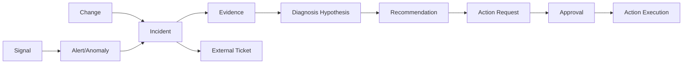

# 领域模型与术语

## 文档状态

本文件给出第一期推荐领域模型。字段、枚举和 Schema 在开始数据库迁移与 API 实现前需要最终评审并固化版本。

## 统一术语

| 中文 | 英文 | 定义 |
|---|---|---|
| 原始信号 | Signal | 指标点、日志、Span、Kubernetes Event、云事件或安全发现等原始输入 |
| 告警 | Alert | 监控系统根据规则或检测算法生成的、需要关注的信号 |
| 异常 | Anomaly | 相对基线出现偏离的现象，不一定已经形成告警或故障 |
| 变更 | Change | 发布、配置、基础设施、权限、数据或人工操作的变化 |
| 故障事件 | Incident | 多个相关信号、告警、异常和变更聚合后形成的可跟踪故障事实 |
| 外部工单 | Ticket | 飞书、企微、Jira、ServiceNow 或其他系统中的处理记录 |
| 证据 | Evidence | 支持或反驳某个诊断结论的可复核数据引用和摘要 |
| 根因候选 | Diagnosis Hypothesis | Agent 根据证据提出的可能原因，不等于已确认根因 |
| 处置建议 | Recommendation | 建议人工或系统采取的下一步检查、缓解或修复方案 |
| 动作 | Action | 对外部运维系统发起的结构化只读或写入操作 |
| 审批 | Approval | 对特定动作、目标、参数、有效期和申请人的明确授权 |
| 服务 | Service | 提供明确业务或技术能力的逻辑组件 |
| 资源 | Resource | 主机、Pod、数据库、队列、负载均衡等运行实体 |

## 领域关系



## 统一事件信封

所有接入数据先转换为统一信封，再进入去重、关联和事件中心。

```json
{
  "schema_version": "1.0.0",
  "event_id": "evt_01J...",
  "event_type": "alert.triggered",
  "source_system": "prometheus",
  "source_event_id": "source-native-id",
  "tenant_id": "tenant-a",
  "deployment_id": "private-prod-01",
  "environment": "production",
  "occurred_at": "2026-07-19T10:31:04.123Z",
  "observed_at": "2026-07-19T10:31:06.010Z",
  "subject": {
    "service_namespace": "commerce",
    "service_name": "order-api",
    "service_instance_id": "instance-opaque-id",
    "resource_type": "k8s.deployment",
    "resource_id": "cluster-a/default/order-api"
  },
  "severity": "high",
  "labels": {},
  "payload_ref": "obs://prometheus/...",
  "content_hash": "sha256:..."
}
```

## 标识与幂等

- `event_id`：智能运维大脑生成的全局唯一标识，推荐使用不可预测的 UUID/ULID。
- `source_event_id`：来源系统中的稳定 ID；来源无 ID 时由适配器生成。
- 接入幂等键：`tenant_id + deployment_id + source_system + source_event_id`。
- 来源没有稳定 ID 时，使用标准化字段计算 `content_hash`，并结合时间桶去重。
- 所有写入 API 和 MCP 事件写入工具必须接受 `idempotency_key`。
- 重试不能创建重复 Incident、重复 Evidence 或重复外部 Ticket。

## 严重级别

第一期统一为五级，来源系统的级别通过适配器映射：

| 级别 | 含义 |
|---|---|
| `critical` | 核心业务中断、安全事故或大范围数据风险，需要立即处理 |
| `high` | 重要服务显著降级，可能快速扩大 |
| `medium` | 局部影响或存在明确风险，需要排期处理 |
| `low` | 低影响异常或优化事项 |
| `info` | 仅用于上下文的状态或变更信息 |

级别计算必须记录来源级别、业务重要度、影响范围和最终映射理由。

## Incident 推荐字段

```text
incident_id
schema_version
tenant_id
deployment_id
title
status
severity
started_at
detected_at
acknowledged_at
recovered_at
closed_at
affected_services[]
affected_resources[]
alert_fingerprints[]
signal_refs[]
change_refs[]
evidence_refs[]
hypotheses[]
recommendations[]
owner_team
assignee
external_ticket_refs[]
created_by
updated_at
version
```

`version` 用于乐观并发控制，避免 Agent、用户和通知回调同时更新时互相覆盖。

## Incident 状态

```text
OPEN
ACKNOWLEDGED
INVESTIGATING
MITIGATING
RECOVERED
CLOSED
```

特殊结果不作为主状态混用，使用独立字段表达：

- `resolution = false_positive`
- `resolution = duplicate`
- `resolution = resolved`
- `duplicate_of = incident_id`
- `merged_into = incident_id`

状态转换必须记录操作者、时间、理由和来源渠道。

## 事件关联与聚合

第一期采用可解释的规则优先：

1. 相同租户和环境。
2. 相同服务、资源或明确上下游依赖。
3. 时间窗口重叠。
4. 相同错误模式、告警指纹或变更对象。
5. 已有 Incident 尚未关闭或处于可重新打开窗口。

AI 可以给出“建议合并”及理由，但第一期不允许模型绕过规则直接不可逆合并事件。

关联结果需要保存：

```text
correlation_rule_id
correlation_score
matched_dimensions[]
time_window
decision_source
```

## Evidence 证据模型

每条证据必须包含：

```text
evidence_id
incident_id
source_system
query_or_tool
query_parameters_hash
time_range
summary
raw_reference
supports_hypothesis_ids[]
contradicts_hypothesis_ids[]
collected_at
collected_by
redaction_status
```

- Agent 上下文只保存摘要和引用，不复制大量原始日志。
- `raw_reference` 必须再次经过授权才能访问。
- Evidence 原始内容不可被 Agent 覆盖；修正使用新版本或追加记录。
- 根因候选没有 Evidence 时必须标记为低置信度或拒绝发布。

## 根因候选

```text
hypothesis_id
statement
confidence
supporting_evidence_ids[]
contradicting_evidence_ids[]
missing_evidence[]
next_readonly_checks[]
status = proposed | supported | rejected | confirmed
confirmed_by
```

只有人工确认或满足未来明确的确定性验证规则时，才能进入 `confirmed`。

## 时间与版本规范

- API 和存储统一使用 UTC、RFC 3339/ISO 8601 时间戳。
- 前端按用户时区展示。
- 同时保留 `occurred_at` 与 `observed_at`，以识别采集延迟。
- Schema 使用语义化版本；新增可选字段不破坏兼容，删除或改变语义升级主版本。
- 事件消费者必须忽略未知可选字段，拒绝未知主版本。

## 工单边界

- Incident 是内部事实来源。
- Ticket 是外部协作系统中的投影。
- 一个 Incident 可以关联多个 Ticket，但必须有明确主 Ticket。
- 外部状态回调需要幂等处理和权限校验。
- 删除外部消息或工单不能删除内部 Incident。

