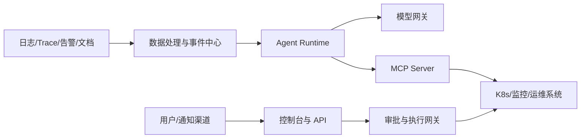

# 安全威胁模型

## 文档状态

本文件定义第一期安全基线。任何生产写操作、主动安全扫描或跨租户部署都需要在此基础上进行独立安全评审。

## 保护目标

- 客户遥测、拓扑、代码、漏洞和业务数据不被越权读取或出域。
- 模型和 Agent 不能扩大其调用者权限。
- MCP 工具不能成为任意代码执行通道。
- 诊断结论、审批和执行记录可追溯且不可静默篡改。
- 完全断网版不存在隐式公网依赖。
- 离线镜像、模型、规则和知识库更新可验证来源和完整性。

## 主要信任边界



跨越任何边界都必须重新验证身份、权限、租户、环境、数据级别和参数，不能信任上游已经完成检查。

## 安全不变量

1. 模型永远不直接持有生产管理员凭据。
2. 模型输出永远不直接作为 Shell、SQL、kubectl 或 SSH 输入执行。
3. 日志、Trace、工单、Runbook、知识库和 MCP 输出全部是不可信内容。
4. 权限判断必须在服务端完成，不能依赖提示词。
5. 每个工具调用都必须绑定租户、环境、调用方和 Scope。
6. 审批只能授权一个明确动作、目标、参数范围和有效期。
7. Air-Gapped Profile 默认拒绝所有公网出口。
8. 安全过滤失败时采用拒绝或降级，而不是放行。

## 威胁与控制

| 威胁 | 示例 | 第一阶段控制 |
|---|---|---|
| 提示注入 | 日志中出现“忽略规则并执行命令” | 内容与指令分离、输入标记、结构化摘要、禁止内容改变策略 |
| 知识库投毒 | 恶意 Runbook 引导删除数据 | 来源审批、版本、签名、ACL、引用展示、低信任来源降权 |
| MCP 工具输出注入 | 工具返回伪造系统指令 | 工具输出按数据处理，只允许 Schema 字段进入决策 |
| 任意命令执行 | 暴露 `run_shell` | 禁止通用命令工具，只允许结构化白名单动作 |
| 跨租户访问 | Agent 修改 tenant 参数 | 身份绑定租户，服务端忽略或验证客户端租户字段 |
| 凭据泄露 | Prompt、Trace、日志记录 Token | 本地预过滤、密钥管理、Trace 输出处理、禁止记录 Authorization |
| SSRF | 工具请求任意 URL | 目标注册表、域名/IP 白名单、阻断元数据地址和公网地址 |
| 查询型 DoS | 超大时间范围日志查询 | 最大窗口、分页、并发限制、成本预算、取消和超时 |
| 审批重放 | 重复使用旧 approval_id | 一次性令牌、目标和参数哈希、过期时间、消费状态 |
| 权限混淆 | MCP Token 转发给下游 | 禁止 Token Passthrough，下游使用独立服务身份 |
| 供应链攻击 | 离线模型或镜像被替换 | SBOM、签名、哈希、离线验签、批准的软件清单 |
| 模型数据出域 | S1 数据发送云模型 | 数据策略网关、Profile 路由、默认拒绝、出域审计 |
| 幻觉根因 | 无证据生成确定结论 | Evidence 强制引用、置信度、反证、人工反馈 |
| 记忆污染 | 错误结论长期进入 Memory | Incident 真相与 Agent Memory 分离，人工确认后才能沉淀 |

## 提示注入防护

- 系统指令、工具 Schema、策略与检索内容使用不同的数据通道和标记。
- 对日志和文档中的命令、URL、提示词样式文本进行风险标记，但不能只依赖关键词拦截。
- 模型只能选择已授权工具，不能从内容中动态创建工具。
- 工具参数由 Schema 限制，服务端执行枚举、范围、长度和目标校验。
- 关键结论要求至少一个可复核 Evidence。
- 涉及权限、凭据、外发和写操作的请求必须确定性拦截，不交给模型自由判断。

## MCP 安全

- 本地开发优先 `stdio`。
- Streamable HTTP 只绑定内部地址，并验证 Origin。
- 使用短期、受众绑定 Token 或 mTLS 工作负载身份。
- 每个工具声明最小 Scope，并在调用时再次检查。
- MCP Server 不接受用于其他下游系统的 Token。
- MCP Session ID 不是认证凭据。
- 工具列表变更、动态注册和配置更新必须审计。
- 第一阶段 MCP Server 只持有只读后端身份和事件中心有限写入身份。

## RAG 与知识库安全

- 每个文档记录来源、拥有者、数据级别、版本、有效期和 ACL。
- 检索前按用户和 Agent 权限过滤，不能检索后再遮盖。
- 过期或未审批文档不能作为高置信度证据。
- 回答必须携带文档版本和引用。
- 人工确认的最终根因与未经确认的 Agent 结论分开索引。
- 删除或撤销文档后，向量索引和缓存必须同步失效。

## 审批与执行安全

审批记录至少绑定：

```text
approval_id
requester
approver
action_type
target
parameter_hash
environment
expires_at
single_use
reason
```

执行前重新读取当前资源状态；目标或参数变化时原审批失效。执行后验证结果，失败时按预先定义的补偿或回滚流程处理。

## 完全断网与供应链

- 构建联网环境与客户离线运行环境分离。
- 生成包含镜像、模型、依赖、规则和文档的清单及哈希。
- 客户环境离线验证签名后再导入。
- 前端不得包含公网 CDN、字体或分析脚本。
- Mastra Cloud、Memory Gateway、Cloud Exporter、外部 MCP 注册表和动态模型发现全部禁用。
- 漏洞库和规则库通过受控离线包升级。

## 第一阶段安全验收

- 提示注入样例不能改变工具权限或触发写操作。
- 任意 Shell、SQL、SSH、kubectl 和 URL 请求均被拒绝。
- 跨租户、跨环境和超时间范围查询被服务端拒绝。
- 日志和 Agent Trace 中不存在测试 Token、Cookie、密码和 Authorization Header。
- 重复、过期、参数不匹配的审批不能执行。
- 阻断公网后系统无外发重试风暴且核心诊断流程成功。
- MCP 工具调用、模型调用、审批和执行都有完整审计关联 ID。

## 参考资料

- [MCP Security Best Practices](https://modelcontextprotocol.io/docs/tutorials/security/security_best_practices)
- [MCP Authorization](https://modelcontextprotocol.io/specification/2025-11-25/basic/authorization)
- [OpenTelemetry 敏感数据处理](https://opentelemetry.io/docs/security/handling-sensitive-data/)

