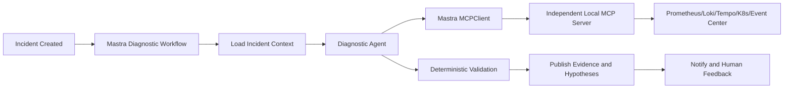

# Agent Runtime 与 Mastra 适配方案

## 决策状态

Mastra 是第一期 Agent Runtime 的**推荐候选**，尚未成为不可替换的最终技术栈。正式采用前需要完成一个完全本地、连接本地 MCP Server 和本地模型的技术验证。

推荐理由：

- TypeScript/Node.js 技术栈便于与 Web、API 和 MCP 共享 Schema。
- 提供 Agent、类型化 Tools、Workflow、MCP、Memory、Storage、Tracing 和 Scorers。
- Workflow 支持顺序、并行、分支、循环以及暂停/恢复。
- 可以使用 PostgreSQL 保存 Workflow、Memory、Score 和 Observability 等状态。
- 支持 OpenTelemetry 兼容的可观测后端。
- 开源核心可以在自有基础设施运行。

## Mastra 能力映射

| 项目需求 | Mastra 能力 | 使用方式与限制 |
|---|---|---|
| 确定性诊断流程 | Workflow | 固定主流程，Agent 只处理需要推理的步骤 |
| 人工审批 | suspend/resume + Snapshot | 只暂停 Workflow；审批真相仍由事件中心/审批服务保存 |
| MCP 工具 | MCPClient/MCPServer | Agent 通过 MCPClient 调本地 MCP；生产凭据尽量不与 Runtime 共进程 |
| 模型切换 | Model/provider abstraction | 统一通过项目模型网关，不直接依赖动态公网模型目录 |
| 状态持久化 | Storage/PostgreSQL | Mastra 表与业务事件表分开管理 |
| Agent 追踪 | Observability/OTel | 只发送到本地 OTel 后端，输出前脱敏 |
| 质量评估 | Scorers | 用于相关性、完整性和证据质量；安全门禁仍使用确定性测试 |
| 对话记忆 | Memory | 仅用于交互上下文，不作为 Incident、CMDB 或最终根因事实库 |

## 第一阶段运行架构



第一期采用一个主诊断 Agent，不直接建设复杂 Supervisor Agent 网络。确定性 Workflow 负责步骤、预算、重试、状态和审批；Agent 负责提出假设、选择下一条只读检查以及组织解释。

## 推荐诊断 Workflow

```text
1. validate_incident
2. load_service_and_topology
3. load_recent_changes
4. collect_baseline_evidence
5. agent_generate_hypotheses
6. collect_targeted_evidence
7. validate_schema_and_permissions
8. rank_hypotheses
9. publish_diagnosis
10. notify_and_collect_feedback
```

- 每个步骤定义输入输出 Schema。
- 大数据只保存引用，不放入 Workflow Snapshot。
- 步骤重试必须幂等。
- Agent 循环次数和 MCP 工具预算由 Workflow 控制。
- 取消、超时和失败必须写回 Incident 时间线。

## 状态与存储

### 本地技术验证

- 可以使用 LibSQL 快速验证 Workflow、Snapshot 和 Scorers。
- 测试数据和本地数据库不能进入 Git。

### 私有化与生产

- 推荐使用 PostgreSQL 适配器保存 Mastra Workflow、Score 和必要运行状态。
- 智能运维大脑自己的 Incident、Evidence、Approval 和 Audit 使用项目自有 Schema。
- 不直接依赖 Mastra 内部表作为事件中心 API。
- Workflow Snapshot 只保存可序列化的小对象和引用。
- 数据库迁移和备份策略需要覆盖 Mastra 表，但与领域表分别验证。

## Memory 边界

Mastra Memory 不等于运维知识库或项目长期事实：

- Incident 是故障事实来源。
- 服务目录和拓扑是资源事实来源。
- 运维知识库负责 Runbook、架构文档和历史复盘。
- Mastra Memory 只保存当前交互、短期偏好或经过批准的摘要。
- 未经人工确认的根因不得自动写入长期知识。
- Air-Gapped 版不使用 Mastra Memory Gateway。

## 模型接入

- Agent Runtime 只调用项目模型网关。
- 云上模型网关支持注册客户批准的 Provider；开发阶段首批实现 DeepSeek API 和 Qwen API，统一使用服务端 API Key 引用。
- 第一阶段提供 Custom OpenAI-compatible Provider；不兼容该协议的模型通过独立原生 Adapter 扩展。
- 正式 AWS Profile 保留 Bedrock 或批准的 AWS 推理服务 Provider，不要求与开发阶段使用同一个模型。
- Private Connected 可以按数据策略选择本地或云端模型。
- Air-Gapped 只允许显式配置的本地模型端点。
- 禁止运行时从公网动态获取模型目录或自动切换未知提供商。
- 本地模型兼容性、结构化输出和 Tool Calling 必须通过 Golden Incidents 验证。
- Provider 的 Chat、Tool Calling、结构化输出和推理参数差异由模型网关适配，Mastra Workflow 不直接依赖厂商 SDK。
- Air-Gapped 必须先通过硬件与离线模型预检，再启动本地推理和 Mastra；预检失败时整个离线运行链路停止。

## MCP 集成

- Mastra `MCPClient` 负责发现和调用本项目批准的 MCP Tools、Resources。
- 本地开发使用 `stdio`。
- Kubernetes 内部使用 Streamable HTTP。
- 工具列表不能从公网注册表动态扩展。
- MCP Server 保持独立安全边界，并拥有独立后端身份。
- 即便 Mastra 支持把 Agent 暴露为 MCP Tool，第一期也不对生产环境开放“Agent 调 Agent”的递归网络。

## 人工审批

Mastra Workflow 的 `suspend/resume` 适合暂停等待人工决定，但：

- 审批记录由项目审批服务保存。
- Resume 请求需要重新验证用户身份和审批权限。
- Snapshot 中只保存 `approval_request_id`，不保存可复用生产凭据。
- 审批绑定动作、目标、参数哈希、环境和有效期。
- Resume 后执行网关仍需重新检查当前资源状态。

## 可观测性

- 使用 Mastra Trace 记录 Workflow Step、Agent Run、模型调用、Tool Call 和错误。
- 通过 OpenTelemetry 输出到本地可观测后端。
- Air-Gapped 禁用 CloudExporter 和所有托管可观测出口。
- Prompt、Completion、工具输入输出和 Memory 在导出前脱敏。
- Incident ID、Workflow Run ID、MCP Call ID 和 Trace ID 相互关联。
- Mastra Studio 只作为开发与诊断界面，不作为事件中心事实库。

## 完全断网约束

- 所有 npm 包、镜像和 Mastra 依赖进入离线依赖包。
- 不使用 Mastra Cloud、Memory Gateway、CloudExporter 或在线模型注册表。
- Studio、Server、Runtime、PostgreSQL、MCP Server、模型和 OTel 后端全部部署在本地。
- 禁止页面或 Runtime 拉取公网静态资源和遥测。
- 需要审查 Mastra 核心与可选企业功能的许可证，确认离线交付边界。

## 技术验证任务

1. 使用 TypeScript 创建最小 Mastra 项目。
2. 创建包含固定步骤和一个诊断 Agent 的 Workflow。
3. 通过 `MCPClient` 调用模拟事件、Prometheus 和 Kubernetes 工具。
4. 在云上开发 Profile 分别连接 DeepSeek API、Qwen API 和一个模拟 Custom OpenAI-compatible Provider。
5. 在 Air-Gapped Profile 连接本地 OpenAI-compatible 模型端点。
6. 验证两类云端 Provider 与本地 Provider 的结构化输出、工具调用、超时和能力差异。
7. 实现离线主机预检，并验证资源不足时模型与 Runtime 均不会启动。
8. 使用 PostgreSQL 保存 Workflow Snapshot。
9. 在人工步骤 `suspend`，重启 Runtime 后 `resume`。
10. 将 Trace 输出到本地 OTel Collector。
11. 添加确定性测试和自定义 Scorer。
12. 阻断公网，验证整个流程没有外发请求和云模型回退。

## 采用门槛

只有同时满足以下条件才把 Mastra 从“推荐候选”改为“已确认”：

- 完全断网运行成功。
- 本地模型与 MCP 工具调用稳定。
- Workflow 暂停、重启和恢复保持幂等。
- PostgreSQL 存储和迁移符合项目要求。
- OTel Trace 可以完全本地化并完成脱敏。
- 资源占用符合 Offline POC 基线。
- 核心与所需功能许可证允许目标交付方式。
- 不依赖托管平台才能完成第一期功能。

## 不采用时的替换边界

领域模型、MCP Contracts、事件中心、模型网关和适配器不能依赖 Mastra 私有类型。Agent Runtime 只通过项目定义的接口使用这些能力，确保必要时可以替换其他 TypeScript 或跨语言编排实现。

## 参考资料

- [Mastra Documentation](https://mastra.ai/docs)
- [Mastra Agents and MCP](https://mastra.ai/docs/agents/mcp-guide)
- [Mastra Workflows](https://mastra.ai/ai-workflows)
- [Mastra Workflow Snapshots](https://mastra.ai/en/reference/workflows/snapshots)
- [Mastra Observability](https://mastra.ai/ai-agent-observability)
- [Mastra Storage](https://mastra.ai/blog/mastra-storage)
- [Mastra Self-hosted Deployment Models](https://mastra.ai/blog/deployment-models)
