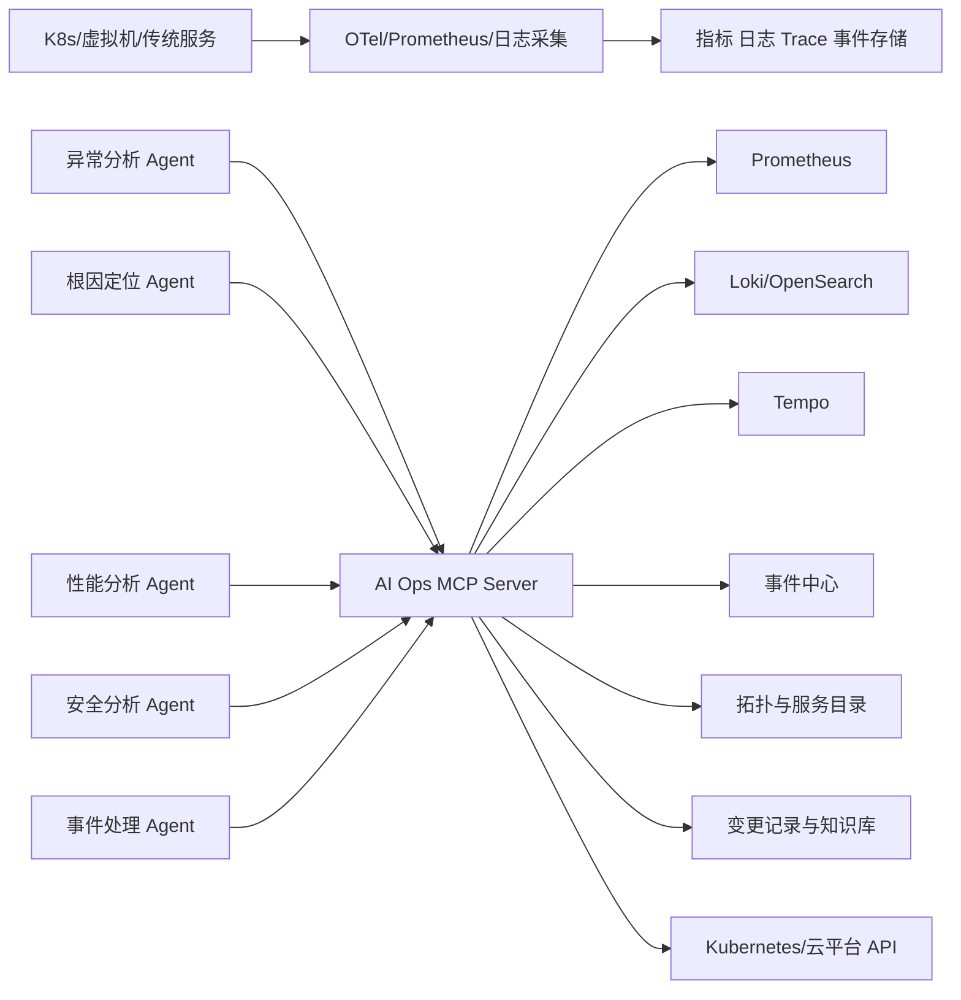

# 本地 MCP Server 与 Agent 工具调用

## 方案定位

智能运维大脑建议自建本地 MCP Server，作为 Agent 访问指标、日志、链路、拓扑、变更记录、事件中心和 Kubernetes 的统一工具边界。

MCP Server 的职责是向 Agent 提供受控的查询和操作能力，不负责承载海量遥测数据采集。指标、日志和 Trace 仍然通过 OpenTelemetry、Prometheus、日志采集器等管道进入对应存储。



## 核心边界

### 遥测数据面

负责持续采集和保存大批量数据：

- OpenTelemetry Collector。
- Prometheus Scrape/Remote Write。
- 文件日志、Syslog 和日志采集 Agent。
- Trace 和 Kubernetes 事件。
- 指标、日志、Trace 及对象存储后端。

### Agent 工具面

由 MCP Server 提供按需、受限、可审计的能力：

- 查询指定服务在限定时间范围内的指标。
- 搜索限定范围和数量的日志。
- 获取指定 Trace。
- 查询 Kubernetes 工作负载状态。
- 查询服务拓扑和最近变更。
- 检索运维手册和历史事件。
- 创建或更新内部事件记录。
- 提交诊断结论和处置建议。

不得使用 MCP 传输全量实时指标、日志流或大文件。MCP 返回给 Agent 的内容需要分页、截断、聚合并附带原始数据引用。

## 第一阶段工具清单

第一阶段以只读诊断和事件记录为主。

| 工具 | 用途 | 权限级别 |
|---|---|---|
| `list_active_incidents` | 查询当前活动事件 | L0 |
| `get_incident_context` | 获取事件证据和时间线 | L0 |
| `query_metrics` | 查询受限指标区间 | L1 |
| `search_logs` | 搜索受限日志范围 | L1 |
| `get_trace` | 获取指定 Trace | L1 |
| `get_workload_status` | 查询 Kubernetes 工作负载状态 | L1 |
| `get_resource_state` | 查询主机、数据库或中间件状态 | L1 |
| `get_recent_changes` | 查询发布和配置变更 | L1 |
| `get_service_topology` | 获取上下游依赖和影响范围 | L1 |
| `search_runbooks` | 检索运维手册 | L0 |
| `append_incident_evidence` | 向事件追加结构化证据 | 事件写入 |
| `publish_diagnosis` | 保存根因候选和处理建议 | 事件写入 |

事件写入只改变智能运维大脑内部状态，不等同于修改生产环境。

## 工具参数设计

工具必须使用明确的结构化参数。例如：

```json
{
  "tool": "query_metrics",
  "arguments": {
    "service": "order-api",
    "environment": "production",
    "metric": "http_error_rate",
    "start": "2026-07-19T10:30:00+08:00",
    "end": "2026-07-19T10:40:00+08:00"
  }
}
```

MCP Server 接到调用后负责：

1. 验证 Agent 身份、角色和 Scope。
2. 验证租户、环境、服务和资源范围。
3. 限制查询时间窗口、结果数量和响应大小。
4. 使用白名单模板生成 PromQL、LogQL 或后端查询。
5. 删除或掩码敏感字段。
6. 返回结构化摘要、证据引用和查询状态。
7. 记录调用方、参数摘要、耗时和结果状态。

## 禁止暴露的通用危险工具

第一阶段不得向 Agent 暴露：

```text
run_shell(command)
execute_sql(sql)
kubectl(args)
ssh_execute(host, command)
run_script(script)
```

这些工具允许模型自由拼接命令，难以执行可靠的权限、参数、幂等和影响范围校验。

后续如果开放写操作，应使用目标明确的工具：

```text
restart_workload(namespace, workload, approval_id)
scale_workload(namespace, workload, replicas, approval_id)
rollback_deployment(deployment_id, approval_id)
```

写操作仍需经过独立执行网关，验证审批记录、动作白名单、目标环境、参数范围、执行前快照和回滚条件。不能只因为 Agent 提供了 `approval_id` 就直接执行。

## MCP 能力类型

### Tools

适合带参数的查询、事件更新和受控动作。智能运维大脑的大部分诊断能力通过 Tools 暴露。

### Resources

适合暴露可寻址的只读上下文，例如：

- 运维手册。
- 服务目录条目。
- 事件详情。
- 架构说明。
- 经过授权的知识库文档。

### Prompts

可以提供标准化诊断流程模板，但核心系统提示词和安全规则仍由 Agent Host 管理，不依赖 MCP Server 动态下发。

## 本地开发传输方式

本地开发优先使用 `stdio`：

```text
Agent Client
  -> 启动 MCP Server 子进程
  -> stdin/stdout JSON-RPC 通信
```

优点：

- 不开放网络端口。
- Server 生命周期由 Agent Client 管理。
- 适合单开发者调试。
- 减少被网页或其他网络进程调用的风险。

约束：

- `stdout` 只能输出合法 MCP 消息。
- 调试日志写入 `stderr`。
- 凭据通过受控环境或本地密钥存储提供，不能写入仓库。

## Kubernetes 私有化部署

多 Agent 和 Kubernetes 环境使用 Streamable HTTP：

```text
Agent Pods
  -> Kubernetes Internal Service
  -> MCP Server Deployment
  -> 后端适配器
```

部署要求：

- 仅创建集群内部 Service，默认不创建公网 Ingress。
- 使用 NetworkPolicy 限制只有 Agent Runtime 可以访问。
- 验证 Origin，避免 DNS Rebinding 风险。
- 使用 HTTPS/mTLS 或符合 MCP 规范的 OAuth 2.1。
- Token 必须绑定 MCP Server 受众，禁止 Token Passthrough。
- 使用短期 Token 和最小权限 Scope。
- Server 使用独立 ServiceAccount，不能默认授予 `cluster-admin`。
- 对不同租户、环境和工具实施服务端权限检查。

新实现使用 Streamable HTTP，不以旧 HTTP+SSE 作为主传输方式。

## 多 Agent 权限划分

可以由多个 Agent 连接同一个模块化 MCP Server，但每个 Agent 获得不同的工具集合和 Scope。

| Agent | 建议能力 |
|---|---|
| 异常分析 Agent | 指标、日志模式和当前告警 |
| 根因定位 Agent | Trace、拓扑、变更和历史事件 |
| 性能分析 Agent | 指标区间、慢调用和资源使用情况 |
| 安全分析 Agent | 已有安全发现、资产和变更记录 |
| 事件处理 Agent | 创建事件、更新状态和触发通知 |
| 执行 Agent | 只能提交动作申请或调用已审批动作 |

第一期不需要拆成多个独立 MCP Server。建议先建设一个模块化 Server，通过工具命名空间、Scope 和适配器隔离能力。只有在安全边界、团队归属或扩缩容需求明确后，再拆分可观测性 MCP、安全 MCP、事件 MCP 和执行 MCP。

## 与 Mastra 的集成建议

Mastra 同时提供 Agent、Workflow、类型化 Tools、MCP Client 和 MCP Server 能力，适合用于第一期技术验证：

- Agent Runtime 通过 Mastra `MCPClient` 获取本地运维工具。
- 运维工具使用明确的输入输出 Schema，不直接把后端凭据交给 Agent。
- 已有 Mastra Tool 可以通过 `MCPServer` 暴露给其他兼容客户端。
- 第一阶段仍建议把运维 MCP Server 视为独立安全边界，避免 Agent Runtime 与生产凭据完全共进程。
- Mastra 的工具审批不能替代项目自己的审批记录和执行网关。
- Air-Gapped Profile 禁止动态发现公网 MCP Server。

Mastra 采用与限制详见 [阶段 0 Agent Runtime 与 Mastra](../phase-0/agent-runtime-design.md)。

## 完全断网要求

- MCP Server 镜像和依赖进入离线安装包。
- 工具定义、Schema 和策略文件全部本地提供。
- 禁止从公网动态发现或安装 MCP Server。
- MCP Server 只连接客户内网中的数据源和 API。
- 本地模型、Agent Runtime 和 MCP Server 不依赖云端服务。
- 工具列表和权限配置变更必须经过本地审计。
- 外部飞书、企微 MCP 或其他公网连接器在 Air-Gapped Profile 中禁用。

## 推荐项目结构

```text
ai-ops-agent/
├── apps/
│   ├── web/
│   ├── api/
│   ├── agent-runtime/
│   └── mcp-server/
├── packages/
│   ├── mcp-contracts/
│   ├── event-domain/
│   ├── policy-engine/
│   ├── model-gateway/
│   └── adapters/
│       ├── prometheus/
│       ├── loki/
│       ├── tempo/
│       ├── kubernetes/
│       └── event-center/
├── deploy/
│   ├── helm/
│   └── air-gap/
└── docs/
```

该目录只是当前推荐，不代表已经确定使用 Monorepo 或具体语言。正式创建代码前仍需确认技术栈。

## 建议实施顺序

1. 定义 MCP 工具命名、输入输出 Schema 和统一错误格式。
2. 使用模拟数据实现本地 `stdio` MCP Server。
3. 实现事件中心、Prometheus 和 Kubernetes 三个适配器。
4. 增加调用审计、超时、结果截断和敏感字段处理。
5. 接入 Agent Runtime，验证一次完整根因分析流程。
6. 增加 Streamable HTTP 和 Kubernetes 内部部署。
7. 增加身份认证、Scope、NetworkPolicy 和完全断网测试。
8. 最后再讨论需要人工审批的执行工具。

## 当前推荐结论

- 自建本地 MCP Server 作为 Agent 工具调用入口。
- 遥测采集不经过 MCP。
- 本地开发使用 `stdio`。
- 私有化多 Agent 部署使用 Streamable HTTP。
- 第一期只有一个模块化 MCP Server。
- 第一阶段以只读诊断和内部事件写入为主。
- 禁止向模型暴露任意 Shell、SQL、SSH 或 kubectl 工具。
- 完全断网模式不连接公网 MCP 服务。

## 参考资料

- [MCP Transports](https://modelcontextprotocol.io/specification/draft/basic/transports)
- [MCP Security Best Practices](https://modelcontextprotocol.io/docs/tutorials/security/security_best_practices)
- [MCP Authorization](https://modelcontextprotocol.io/specification/2025-11-25/basic/authorization)
- [MCP Client Best Practices](https://modelcontextprotocol.io/docs/develop/clients/client-best-practices)
