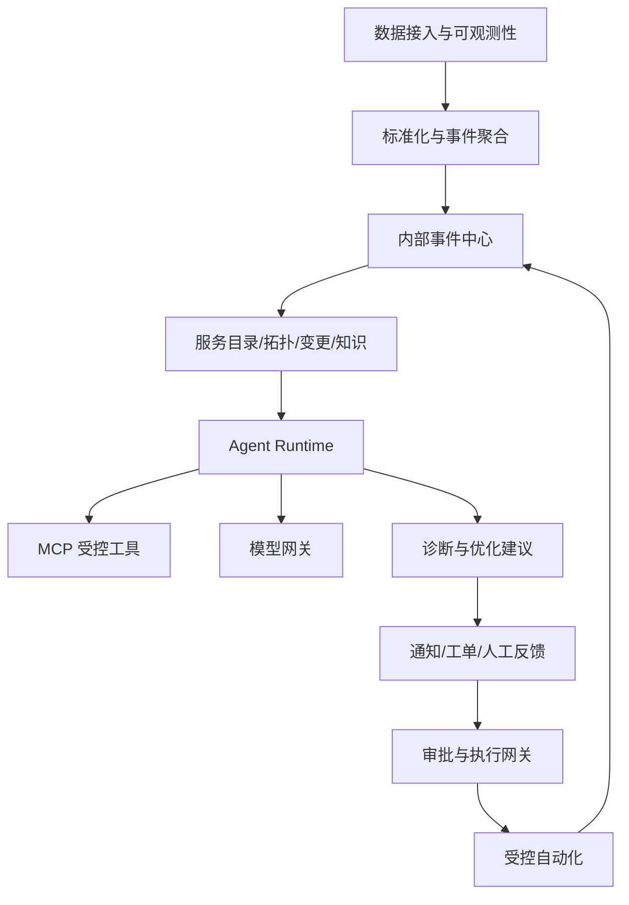

# 智能运维大脑需求大纲

## 1. 文档定位

本文件是“智能运维大脑”项目的总需求规划入口，用于统一管理整体路线、阶段目标、需求进入方式和各阶段文档结构。

后续第一期、第二期、第三期及新增阶段都必须从本大纲派生，不得脱离整体路线单独扩张范围。

本文档负责回答：

- 项目最终要建设成什么。
- 为什么要分阶段建设。
- 每个阶段解决什么问题。
- 阶段之间有哪些依赖。
- 一个新需求应该进入哪个阶段。
- 每一期需要产出哪些文档和交付物。
- 什么条件满足后才能进入下一阶段。

详细架构、安全、数据、测试和运行时方案仍由对应专题文档维护，本文件只保留阶段级结论和索引。

## 2. 状态标记

所有需求和决策使用以下状态：

| 状态 | 含义 |
|---|---|
| 已确认 | 已完成讨论，可以进入设计或实现 |
| 推荐 | 当前推荐方案，仍允许通过评审调整 |
| 待验证 | 需要技术 Spike、压测或真实环境验证 |
| 待确认 | 缺少用户、业务、成本或环境决策 |
| 已实现 | 已完成代码、测试和必要验证 |
| 已延期 | 保留需求，但不进入当前阶段 |
| 已取消 | 明确不再建设，并记录取消原因 |

禁止把“推荐”“待验证”写成“已确认”，禁止把“代码完成”写成“生产可用”。

## 3. 项目愿景

智能运维大脑是一套面向 AWS 云上与本地私有化环境的企业级 AI Ops 平台。

系统统一组织指标、日志、Trace、告警、资源拓扑、变更记录、安全发现和运维知识，通过可验证的 Agent Workflow 提供：

1. 异常分析与告警降噪。
2. 辅助根因定位。
3. 性能瓶颈分析与优化建议。
4. 安全风险关联与影响分析。
5. 内部事件和外部工单闭环。
6. 经过审批、审计和验证的受控运维动作。

项目不以“让大模型直接管理生产环境”为目标，而是逐步建立数据、证据、权限、审批和回滚基础后，再扩大自动化范围。

## 4. 产品部署形态

### 4.1 AWS 云上版

- 独立部署在确定的 AWS 账户和网络边界中。
- 适配 CloudWatch、CloudTrail、AWS Config、EKS、RDS、ALB、WAF 和 Security Hub 等服务。
- 云上产品通过项目模型网关支持客户选择经过批准的 Provider；DeepSeek API 和 Qwen API 仅作为开发阶段首批适配器。
- 第一阶段支持 Custom OpenAI-compatible Provider，不兼容该协议的模型通过原生 Adapter 扩展。
- 正式 AWS 交付保留 Amazon Bedrock 或批准的 AWS 推理服务适配能力。

### 4.2 本地私有化联网版

- 部署在客户内网。
- 原始遥测默认保留在客户环境。
- 只有经过数据策略允许的请求可以通过受控代理访问云模型、飞书或企业微信。

### 4.3 完全断网版

- 安装、运行、授权、模型、知识库、监控、备份和升级全部在本地完成。
- 启动前必须检查当前宿主机或推理节点；低于所选模型最低配置时阻止本地模型和 Agent Runtime 启动。
- 不依赖公网 DNS、NTP、镜像仓库、模型、许可证、遥测和前端资源。
- 使用内部控制台或客户已有内网通知渠道。

三种形态共享领域模型、接口契约、核心代码和测试标准，但运行数据默认不互通。

## 5. 总体能力地图



### 5.1 数据与可观测

- OpenTelemetry、Prometheus、日志、Trace、Kubernetes Event。
- AWS、虚拟机、物理机、数据库、中间件和传统设备适配器。
- 数据分级、脱敏、采样、保留和容量控制。

### 5.2 事件与拓扑

- 告警指纹、去重、抑制、关联和 Incident 生命周期。
- 资产拓扑、服务目录、运行时拓扑和变更时间线。
- Evidence、根因候选、处理建议和人工反馈。

### 5.3 Agent 与模型

- 可恢复的确定性 Workflow。
- 自建本地 MCP Server。
- 可插拔模型网关、客户自定义 Provider、DeepSeek/Qwen 首批开发适配、本地模型和后续 AWS 原生适配。
- Air-Gapped 模型规格清单、主机预检、启动门禁和禁止云端回退。
- Agent Trace、Scorers、Golden Incidents 和质量回归。

### 5.4 执行与治理

- RBAC、Scope、审批、工具白名单和最小权限。
- 动作目录、执行前检查、执行后验证、回滚和紧急停止。
- 审计、合规、完全断网和离线供应链。

## 6. 整体规划流程

任何阶段和新增需求都按照以下流程推进：


### 6.1 需求提出

每个需求至少说明：

- 谁遇到了什么问题。
- 当前处理方式和成本。
- 期望业务结果。
- 涉及的部署形态和环境。
- 是否包含敏感数据、外部调用、生产写操作或持续费用。

### 6.2 阶段归属

使用以下规则判断：

- 验证框架、模型、MCP、存储和断网可行性：阶段 0。
- 只读事件闭环和辅助诊断：阶段 1。
- 企业系统接入、身份、性能和安全分析增强：阶段 2。
- 审批、执行、回滚和低风险自动化：阶段 3。
- 预测、复杂多 Agent、跨地域和规模化产品能力：阶段 4 或后续阶段。

无法明确归属的需求先进入 `docs/07-open-decisions.md`，不得直接进入开发。

### 6.3 设计评审

需求进入实施前必须检查：

- 是否改变领域模型或 API。
- 是否引入新数据出域路径。
- 是否扩大 Agent 或 MCP 权限。
- 是否影响完全断网能力。
- 是否产生持续费用。
- 是否需要新的硬件、GPU 或存储。
- 是否需要新增 ADR。

### 6.4 发布门禁

每个阶段必须通过：

- 功能验收。
- Schema 与契约测试。
- Golden Incidents 回归。
- 权限和提示注入测试。
- 数据泄漏检查。
- 性能与恢复测试。
- 对私有化版本执行完全断网验证。
- 升级、回滚和已知问题评审。

## 7. 阶段依赖


后一阶段可以提前研究，但不能绕过前一阶段的安全、数据和验收基础进入生产。

## 8. 阶段 0：关键技术验证

### 8.1 阶段目标

证明本地 Agent Runtime、MCP、模型、Workflow 状态、可观测性和完全断网链路可行，为第一期选型提供证据。

### 8.2 主要用户

- 架构师。
- Agent 与后端开发人员。
- 平台和运维工程师。
- 安全评审人员。

### 8.3 包含范围

- 最小 Mastra Workflow 和一个诊断 Agent。
- 本地 MCP Server。
- 模拟事件中心、Prometheus 和 Kubernetes 工具。
- PostgreSQL Workflow Snapshot。
- DeepSeek API、Qwen API、Custom OpenAI-compatible Provider 和本地 OpenAI-compatible 模型端点。
- Air-Gapped 主机硬件、驱动、磁盘和模型权重预检。
- OpenTelemetry Trace 输出到本地后端。
- Workflow `suspend/resume`。
- 无公网环境验证。

### 8.4 不包含范围

- 完整 Web 产品。
- 真实生产写操作。
- 高可用和大规模压测。
- 复杂多 Agent 网络。
- 完整外部系统适配器。

### 8.5 交付物

- 可运行 Spike。
- 技术验证报告。
- 资源占用数据。
- Mastra 采用或不采用的 ADR。
- 本地模型初步评测。
- DeepSeek、Qwen、Custom OpenAI-compatible 和本地 Provider 的统一契约与对比报告。
- 离线预检报告格式、模型规格清单和失败启动证据。
- 完全断网请求审计结果。

### 8.6 退出条件

- MCP、DeepSeek、Qwen、Custom Provider、本地模型、Workflow、PostgreSQL 和 OTel 链路按各自 Profile 可运行。
- 当前主机或推理节点低于最低要求时，Air-Gapped 模型和 Agent Runtime 均被阻止启动并输出可操作提示。
- Runtime 重启后暂停任务可以恢复且保持幂等。
- 阻断公网后不产生外发依赖。
- 许可证和离线交付方式可接受。
- 明确第一期最终 Agent Runtime 方案。

## 9. 阶段 1：只读智能诊断闭环

### 9.1 阶段目标

交付“告警进入—事件聚合—证据收集—根因候选—处理建议—人工反馈”的只读闭环。

### 9.2 主要用户

- 运维与 SRE。
- 应用开发人员。
- 架构师和技术负责人。

### 9.3 核心场景

- Pod CrashLoopBackOff。
- 数据库连接池耗尽。
- 发布后错误率上涨。
- 下游接口超时。
- 节点磁盘耗尽或不可用。
- Redis 命中率下降。

### 9.4 包含范围

- Prometheus/Alertmanager、OTel、Webhook 和 Kubernetes 接入。
- 告警标准化、指纹、去重、抑制和基础关联。
- 内部 Incident 中心和时间线。
- 基础服务目录、动态拓扑和最近变更。
- 一个诊断 Agent 和确定性 Workflow。
- 事件中心、Prometheus、Kubernetes MCP 适配器。
- Evidence、根因候选、置信度、反证和处理建议。
- Web 控制台基础页面。
- 飞书、企微、Webhook 或内网通知。
- Golden Incidents 和完全断网回归。

### 9.5 不包含范围

- 主动漏洞扫描。
- 自动重启、扩容、回滚和切流。
- 大规模多 Agent 网络。
- 多租户商业化能力。
- 复杂预测和自训练异常模型。

### 9.6 交付物

- 第一阶段 PRD 和用户流程。
- OpenAPI、JSON Schema 和 MCP Contracts。
- 数据库设计与迁移。
- 单节点 Offline POC 安装包。
- Web、API、事件中心、Agent Runtime 和 MCP Server。
- 测试、评估、安全和断网报告。

### 9.7 退出条件

- Golden Incidents 可以稳定形成唯一 Incident。
- 诊断结论具备可复核 Evidence，不生成无证据确定性根因。
- 所有工具调用可审计，越权和任意命令被拒绝。
- 飞书或企微不可用时不影响内部事件中心。
- 完全断网环境可以完成核心诊断流程。
- 人工可以采纳、拒绝和修正诊断结果。

## 10. 阶段 2：企业集成与分析增强

### 10.1 阶段目标

把第一期原型扩展为可以在真实企业环境持续运行的私有化运维平台。

### 10.2 包含范围

- CloudWatch、AWS Config、CloudTrail、Sentry、Zabbix、OpenSearch 等适配器。
- 虚拟机、物理机、数据库、中间件和传统设备支持。
- 更完整的服务目录、资源关系和运行时拓扑。
- 性能瓶颈分析和容量建议。
- 对已有安全发现进行关联和影响分析。
- 外部工单双向同步。
- LDAP、OIDC、AD 或客户身份源。
- RBAC、多环境隔离和审计治理。
- 高可用部署、备份恢复和离线升级。
- 更完善的模型与知识库评估。

### 10.3 不包含范围

- 默认自动修改生产环境。
- 无审批的高风险动作。
- 主动渗透或攻击性安全测试。

### 10.4 交付物

- 企业集成适配器。
- 身份与权限方案。
- 高可用参考架构。
- 离线升级和版本兼容矩阵。
- 性能与安全分析页面。
- 企业场景测试集。

### 10.5 退出条件

- 在真实或等价企业环境连续运行并满足确认后的 NFR。
- 数据、权限和租户/环境隔离通过安全测试。
- 备份恢复、升级和回滚经过演练。
- 主要外部系统集成具备契约测试和失败降级。

## 11. 阶段 3：受控自动化

### 11.1 阶段目标

在第一、二阶段的数据、权限和验证基础上，引入可审批、可审计、可回滚的运维动作。

### 11.2 包含范围

- 动作目录和风险等级。
- 人工审批 Workflow。
- L2 诊断采集动作。
- 经过确认的低风险自动动作。
- 重启、扩容、回滚等结构化动作。
- 执行前状态检查和影响范围确认。
- 幂等、超时、补偿、回滚和紧急停止。
- 执行后健康验证。
- 飞书、企微或内部控制台审批。

### 11.3 安全限制

- 不暴露任意 Shell、SQL、SSH、脚本或 kubectl。
- 审批绑定动作、目标、参数、环境和有效期。
- 审批不能跨动作复用。
- 当前资源状态变化时需要重新审批。
- 高风险动作默认禁止，单独设计和评审。

### 11.4 交付物

- 动作和风险目录。
- 审批与执行网关。
- 回滚与紧急停止机制。
- 安全评审和故障注入报告。
- 自动化效果与人工中止指标。

### 11.5 退出条件

- 所有动作可审计、可验证、可停止。
- 重试不会造成重复副作用。
- 失败动作能够按设计回滚或安全升级人工处理。
- 越权、过期、重放和参数篡改审批全部被拒绝。

## 12. 阶段 4：智能优化与规模化

### 12.1 阶段目标

从事件辅助诊断平台升级为能够持续优化、预测风险并支持复杂组织和基础设施规模的智能运维平台。

### 12.2 候选范围

- 更复杂的异常检测和季节性基线。
- 容量预测与资源优化。
- 历史故障模式学习。
- 性能优化闭环。
- 安全趋势和风险优先级分析。
- Supervisor 与专用多 Agent 协作。
- 多集群、多地域和大规模部署。
- 可选多租户与组织级治理。
- 模型路由、A/B、持续评估和质量漂移监控。
- 产品生命周期、兼容矩阵和规模化交付工具。

### 12.3 进入条件

- 阶段 1 和阶段 2 已形成稳定真实数据。
- 阶段 3 的自动化安全控制已验证。
- 存在足够规模的人工确认事件和反馈数据。
- 新能力有明确业务指标，不以“增加 AI 功能”为唯一理由。

### 12.4 退出条件

由阶段 4 PRD 根据真实业务目标确定，不能在缺少数据基线时提前承诺。

## 13. 后续阶段扩展规则

阶段 5 及以后按照以下原则新增：

- 必须说明现有阶段为什么无法容纳该目标。
- 必须明确业务价值、用户、依赖和风险。
- 必须在本文件中增加阶段概览和进入/退出条件。
- 必须复用第 15 节的阶段文档模板。
- 不允许通过增加新阶段绕过未完成的安全或质量门禁。

## 14. 跨阶段持续工作

以下工作不属于某一个阶段，所有阶段持续维护：

- 领域模型和 Schema 版本。
- 安全威胁模型和依赖漏洞。
- Golden Incidents 和回归测试。
- 非功能基线和容量数据。
- 完全断网安装、升级和恢复验证。
- 模型、提示模板、工具和知识库版本。
- 用户反馈、误报、漏报和根因采纳率。
- ADR 和待确认事项。
- 文档、代码、发布包和兼容矩阵一致性。

## 15. 每一期统一需求模板

后续每一期统一存放在 `docs/phases/phase-{n}/`，不得再把阶段专属文档平铺到 `docs/` 根目录。目录入口、必需文件、专题拆分和归档规则见 [分期文档规范](phases/README.md)。

每一期必须先创建 `README.md` 和 `scope.md`；进入设计、开发和交付时，再补齐对应的设计、任务、测试、发布与回滚文档。PRD 必须包含以下章节，可以按实际内容扩展，但不能省略关键门禁。

```markdown
# 第 N 阶段：阶段名称

## 1. 文档状态与负责人
- 状态：已确认/推荐/待验证/待确认
- 产品负责人：
- 技术负责人：
- 安全负责人：
- 目标版本：

## 2. 背景与问题
- 用户是谁？
- 当前问题是什么？
- 为什么现在解决？
- 不解决的影响是什么？

## 3. 阶段目标
- 业务结果：
- 用户结果：
- 技术结果：
- 可度量指标：

## 4. 用户角色与核心场景
- 角色：
- 场景：
- 前置条件：
- 主流程：
- 异常流程：

## 5. 包含范围
- P0：
- P1：
- P2：

## 6. 不包含范围
- 明确延期或禁止的内容：

## 7. 功能需求
- REQ-PN-DOMAIN-001：
- 优先级：
- 验收标准：
- 依赖：

## 8. 用户流程与页面
- 页面和入口：
- 状态与交互：
- 权限与错误提示：

## 9. 领域模型与数据契约
- 实体和关系：
- API/事件/MCP Schema：
- 幂等、版本和迁移：

## 10. 架构与组件变化
- 新增组件：
- 修改组件：
- 数据流：
- 外部依赖：

## 11. 安全、隐私与权限
- 数据级别：
- 出域路径：
- 身份和 Scope：
- Prompt/MCP/执行威胁：
- 审计要求：

## 12. 部署与完全断网
- AWS：
- Private Connected：
- Air-Gapped：
- 安装、升级和回滚：

## 13. 非功能要求
- 可用性：
- 性能：
- 容量：
- RPO/RTO：
- 保留周期：

## 14. 测试与评估
- 单元和契约测试：
- Golden Incidents：
- 安全测试：
- 性能测试：
- 断网测试：
- Agent Scorers：

## 15. 交付物
- 代码：
- 文档：
- 安装包：
- 测试证据：

## 16. 依赖、风险和降级
- 前置依赖：
- 技术风险：
- 产品风险：
- 降级方案：
- 回滚方案：

## 17. 实施计划
- 任务：
- 依赖：
- 验收：
- 完成定义：

## 18. 发布门禁与退出条件
- 必须通过的门禁：
- 已知问题：
- 下一阶段输入：

## 19. 待确认事项与 ADR
- 待确认：
- ADR：
```

## 16. 需求编号规范

推荐格式：

```text
REQ-P{阶段}-{领域}-{序号}
```

示例：

- `REQ-P1-INC-001`：第一阶段 Incident 需求。
- `REQ-P1-MCP-003`：第一阶段 MCP 需求。
- `REQ-P2-AUTH-002`：第二阶段身份权限需求。
- `REQ-P3-ACTION-005`：第三阶段执行动作需求。

领域缩写保持稳定：

| 缩写 | 领域 |
|---|---|
| OBS | 可观测性与采集 |
| INC | Incident 与事件中心 |
| TOP | 服务目录与拓扑 |
| AGENT | Agent Runtime |
| MCP | MCP 工具 |
| MODEL | 模型网关与本地模型 |
| AUTH | 身份、权限和审批 |
| ACTION | 执行与回滚 |
| SEC | 安全与数据治理 |
| UI | Web 与交互 |
| DEPLOY | 部署、断网和升级 |

## 17. 需求变更规则

- 阶段范围冻结后，新增 P0 需求必须说明阻塞原因和影响。
- 非阻塞需求默认进入下一阶段或 Backlog。
- 改变安全边界、数据出域、生产权限或持续成本的变更必须重新确认。
- 改变领域模型、公共 API 或 MCP Schema 的变更必须提供迁移和兼容方案。
- 删除需求必须记录原因、影响和替代方案。
- 每次阶段评审后更新本大纲、阶段 PRD、ADR 和待确认事项。

## 18. 当前下一步

按照本大纲，接下来依次完成：

1. 阶段 0 Mastra、本地 MCP、本地模型和断网技术验证方案。
2. 第一阶段 PRD 与用户流程。
3. 第一阶段 OpenAPI、JSON Schema 和 MCP Contracts。
4. 第一阶段数据库与存储设计。
5. AWS 与 Air-Gapped 参考部署架构。
6. 第一阶段依赖任务和实施计划。

在阶段 0 关键结论未验证前，不固化不可替换的 Agent Runtime 和模型实现。
